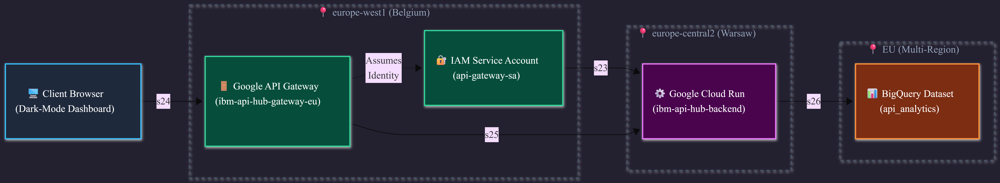
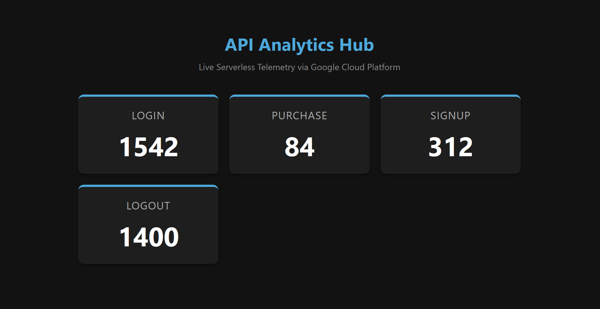

# GCP Serverless API Hub

A secure, serverless telemetry and analytics API built on Google Cloud Platform (GCP). The infrastructure is defined entirely as code (IaC) using Terraform and deployed across European regions for high availability.

## 🏗️ Architecture

This project implements a decoupled, event-driven architecture using the following Google Cloud services:

*   **Google API Gateway (`europe-west1`):** Acts as the secure front door, routing requests defined via an OpenAPI specification and locking out unauthorized public internet traffic.
*   **Cloud Run (`europe-central2`):** A serverless containerized Python (FastAPI) backend that scales dynamically from zero based on incoming traffic.
*   **BigQuery (`EU`):** A serverless data warehouse used for storing and querying aggregated API telemetry data.
*   **IAM & Service Accounts:** Strict Principle of Least Privilege (PoLP) applied. The API Gateway utilizes a dedicated service account to securely invoke the private Cloud Run backend.

## 🛠️ Tech Stack

*   **Backend:** Python 3, FastAPI, Docker
*   **Infrastructure as Code (IaC):** Terraform
*   **Cloud Provider:** Google Cloud Platform (GCP)
*   **Frontend Dashboard:** Vanilla HTML/CSS/JavaScript
*   **CI/CD:** GitHub Actions

## 🚀 Deployment

The entire cloud infrastructure is managed via Terraform. To deploy or update the environment:

1.  Authenticate with Google Cloud:
    ```bash
    gcloud auth application-default login
    ```
2.  Initialize and apply Terraform configurations:
    ```bash
    terraform init
    terraform apply
    ```

## 🔒 Security

*   **Private Backend:** The Cloud Run service does not allow unauthenticated public invocations (`roles/run.invoker` is restricted).
*   **API Gateway Routing:** Only specific endpoints (`/analytics`, `/ingest`) defined in the `openapi.yaml` configuration are exposed to the client dashboard.

## 💻 Local Development

To run the backend locally for development:

1.  Build the Docker container:
    ```bash
    docker build -t api-hub-local .
    ```
2.  Run the container on port 8000:
    ```bash
    docker run -p 8000:8000 api-hub-local
    ```
3.  Open `index.html` in your browser to view the frontend dashboard.

## ⚙️ CI/CD

Automated deployments are handled via GitHub Actions. The workflow defined in `.github/workflows/deploy.yml` will automatically initialize and apply Terraform configurations upon pushes to the main branch.

### **Why this works:**
It takes less than 30 seconds for an engineering manager to read this and immediately understand that you know how to build secure, modern, containerized infrastructure using industry-standard tools like Terraform.

